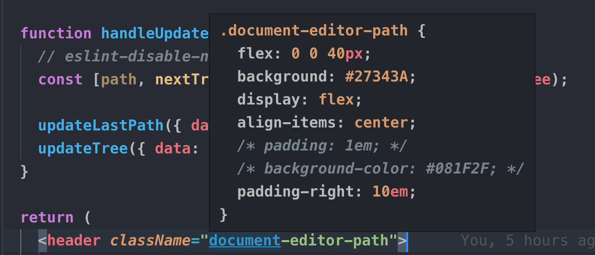

<!-- vscode-markdown-toc -->
* 1. [原则](#)
* 2. [探讨及更新](#-1)
* 3. [前言](#-1)
	* 3.1. [涉及范围](#-1)
* 4. [语法规范](#-1) 
	* 4.1. [ESLint 校验](#ESLint)
	* 4.2. [详细的语法规范, 请阅读 Airbnb 规范:](#Airbnb:)
	* 4.3. [Prettier 格式化](#Prettier)
	* 4.4. [不使用还未确定的语法](#-1)
* 5. [样式规范](#-1)
	* 5.1. [SASS/LESS 约定](#SASSLESS)
	* 5.2. [如无必要, 最好不使用样式嵌套](#-1)
	* 5.3. [全局变量](#-1)
* 6. [目录规范](#-1)
	* 6.1. [工程目录](#-1)
	* 6.2. [工程 alias](#alias)
	* 6.3. [导入 npm 包](#npm)
	* 6.4. [导出 npm 包](#npm-1)
	* 6.5. [文件命名](#-1)
		* 6.5.1. [移除 `index.js`, 让代码懒加载拆分颗粒度更细](#index.js)
		* 6.5.2. [让文件名唯一](#-1)
* 7. [src 目录](#src)
	* 7.1. [actions 目录](#actions)
		* 7.1.1. [约定](#-1)
		* 7.1.2. [依赖规则](#-1)
		* 7.1.3. [内部文件夹规则](#-1)
	* 7.2. [assets 目录](#assets)
		* 7.2.1. [约定](#-1)
		* 7.2.2. [依赖规则](#-1)
	* 7.3. [components 目录](#components)
		* 7.3.1. [约定](#-1)
		* 7.3.2. [依赖规则](#-1)
		* 7.3.3. [内部文件夹规则](#-1)
	* 7.4. [containers 目录](#containers)
		* 7.4.1. [依赖规则](#-1)
		* 7.4.2. [内部文件夹规则](#-1)
	* 7.5. [hocs 目录](#hocs)
		* 7.5.1. [依赖规则](#-1)
		* 7.5.2. [内部文件夹规则](#-1)
	* 7.6. [hooks 目录](#hooks)
		* 7.6.1. [依赖规则](#-1)
		* 7.6.2. [命名规则](#-1)
		* 7.6.3. [内部文件夹规则](#-1)
	* 7.7. [modules 目录](#modules)
		* 7.7.1. [约定](#-1)
		* 7.7.2. [依赖规则](#-1)
		* 7.7.3. [内部文件夹规则](#-1)
	* 7.8. [routers 目录](#routers)
		* 7.8.1. [依赖规则](#-1)
		* 7.8.2. [内部文件夹规则](#-1)
	* 7.9. [tools 目录](#tools)
		* 7.9.1. [依赖规则](#-1)
		* 7.9.2. [内部文件夹规则](#-1)
	* 7.10. [应对变化](#-1)
* 8. [组件规范](#-1)
	* 8.1. [import 声明顺序](#import)
	* 8.2. [导出规范](#-1)
	* 8.3. [类组件文件, 对象声明顺序](#-1)
		* 8.3.1. [UNSAFE 生命周期的解释](#UNSAFE)
		* 8.3.2. [为什么不使用类的装饰器去进行 HOC 操作 ?](#HOC)
	* 8.4. [尽量使用 RenderProps 代替 HOC](#RenderPropsHOC)
	* 8.5. [不要在组件中直接 getState 和 dispatch](#getStatedispatch)
	* 8.6. [不要在组件内部直接调用请求方法](#-1)
	* 8.7. [请求方法的封装规范](#-1)
	* 8.8. [PropTpyes 不是必要的](#PropTpyes)
	* 8.9. [Hooks 组件注意事项](#Hooks)
		* 8.9.1. [使用 useCallback 减少重绘](#useCallback)
		* 8.9.2. [运算量大的语句请放入 `useEffect` 中, 并加以条件限制](#useEffect)
		* 8.9.3. [复杂的 state 逻辑, 请抽离成 `hooks函数`](#statehooks)
	* 8.10. [使用 Hooks 的函数组件文件, 对象声明顺序](#Hooks-1)
* 9. [状态管理规范](#-1)
	* 9.1. [状态管理演化](#-1)
		* 9.1.1. [apollo 和 Relay 缺点](#apolloRelay)
		* 9.1.2. [apollo 和 Relay 可以借鉴的地方](#apolloRelay-1)
		* 9.1.3. [apollo 和 Relay 可以改进的地方 1](#apolloRelay1)
		* 9.1.4. [apollo 和 Relay 可以改进的地方 2](#apolloRelay2)
	* 9.2. [Hooks VS Redux](#HooksVSRedux)
	* 9.3. [Redux 规范](#Redux)
		* 9.3.1. [使用 action 函数, 而不是 dispatch 一个对象](#actiondispatch)
		* 9.3.2. [reducer-in-action 风格，我们只需编写 action 或 sagaAction](#reducer-in-actionactionsagaAction)
		* 9.3.3. [变化和异步分离, 所有 Action 都是同步的, 所有异步的放在 saga 中;](#Actionsaga)
		* 9.3.4. [mapStateToProps 只取所需的数据, 可以有效减少重绘](#mapStateToProps)
		* 9.3.5. [mapDispatchToProps 确保 props 名称和 action 名一致](#mapDispatchToPropspropsaction)
* 10. [测试规范](#-1)
	* 10.1. [单元测试规范](#-1)
	* 10.2. [端对端测试规范](#-1)

<!-- vscode-markdown-toc-config
	numbering=true
	autoSave=true
	/vscode-markdown-toc-config -->
<!-- /vscode-markdown-toc -->

# 前端项目开发规范

> 版本只记录规则修改, 不记录文案修改

| 版本  | 修订内容   | 修订人 | 修订日期  |
| ----- | ---------- | ------ | --------- |
| 0.0.1 | 初始化规范 | [梁柱](https://github.com/ymzuiku)   | 2019-2-28 |


##  1. <a name=''></a>原则

按优先级排序:

> 1. 书写易重构的代码

> 2. 书写可读性强的代码

> 3. 书写更少的代码

##  2. <a name='-1'></a>探讨及更新

规范的最终目的是应用之后, 对于项目而言有持续的收益, 这方面需要大家一起共同对规范进行迭代, 并且落地到自身的工作中. 所以在满足原则的前提下, 希望每一个人都可以对规范提出建议, 我们进行探讨, 将此规范作为一个项目持续迭代, 最终希望`修订记录`上会有每个人的名字, 规范`更新/删除`路径:
 
1. 提出合并请求, 其中说明改动的思路和原由
2. 探讨提议的意义及收益
3. 合并至 master 分支中

##  3. <a name='-1'></a>前言

此规范的目的是围绕一个编码价值观, 制定出一套统一状态管理方式, 统一目录结构, 统一语法规范, 统一模块分离\抽离思路的规则. 保证我们工程更好地阅读 \ 抽离 \ 重构, 以适应长期的迭代需求.

###  3.1. <a name='-1'></a>涉及范围

- 语法规范
- 样式规范
- 目录规范
- 组件规范
- 状态管理规范
- 测试规范

##  4. <a name='-1'></a>语法规范

当下语法规范已有业内优秀的解决方案, ESLint + Prettier, 所以语法规范在工具层面已经解决我们大部分需求了.

###  4.1. <a name='ESLint'></a>ESLint 校验

ESLint 校验有三个环节:

1. 编辑器环节: 在编辑器安装 ESLint 插件, 会读取项目的 .eslintrc 配置, 对不符合规范的代码做出提示, 如:
   
2. webpack eslint-loader 环节: 在开发期间, 对不符合代码规范在浏览器中做出错误提示, 如:
   
3. commit 环节: 在代码提交之前, 我们会对本次提交涉及的代码文件进行 ESLint 校验, 如果不符合规范则不允许提交:
   

其中 ESLint 比较流行的规则有 Google 和 Airbnb , 由于 Google 的规范相对宽松, 不符合我们的需求, 并且 Airbnb 使用的是 React 技术栈, 所以我们使用 Airbnb 的规范作为基础, 再根据我们自身的需求做一些宽松性的修改.

Airbnb 的规范中, 有许多细节都是为了可读性进行设计, 如三目运算不允许多重嵌套等等, 这里篇幅有限, 我们不对语法规范进行展开.

###  4.2. <a name='Airbnb:'></a>详细的语法规范, 请阅读 Airbnb 规范:

> [airbnb/javascript](./airbnb/JavaScript.md)

> [airbnb/react](./airbnb/React.md)

以上规则可以自行阅读, 我们在项目工程中配置了 eslint 进行校验及自动格式化, 只有通过以上规则的代码才能被提交.

###  4.3. <a name='Prettier'></a>Prettier 格式化

Eslint 配合 Prettier 插件, 可以使用 Prettier 根据 Eslint 的规则进行格式化, 从而使得语法书写上的规则基本无痛满足 Eslint 的规范

###  4.4. <a name='-1'></a>不使用还未确定的语法

使用未确定并且未流行的语法往往会带来许多问题, 如 ESLint 检测不识别, prettier 格式化异常, 甚至最后该语法未通过 ES 委员会的审核.

以下语法在 ES7 中还未确定使用方式, 请不要在项目中进行使用.

- `|>` : 管道符号(pipeline-operator), 请使用 pipe 函数进行实现
- `?.` : 请使用 && 符进行判断
- 装饰器声明 export, 请分成两行声明:

  ```js
  @connect()
  class App {}

  export default App;
  ```

##  5. <a name='-1'></a>样式规范

`CSS in JS` 现在还没有特别成熟稳定的方案, 不合适进行长期投入, 较为热门的 `styled-components` 等方案需要投入学习时间, 并且收益不确定, 也不建议使用. 我们只讨论 **CSS 预处理** 方案的规范:

###  5.1. <a name='SASSLESS'></a>SASS/LESS 约定

- 降低依赖
  - 全局变量文件只有 1 个
  - 每个样式文件的样式在当前文件内闭环, 不引用其他样式文件
  - 使用 BEM,防止样式污染, 组件样式以组件名作为 BEM 前缀
- 提高可读性
  - 组件引用的样式文件始终保持在该组件的文件夹内, 并且名称一致 (好查找)
  - 样式嵌套控制在 3 层以内, **如无必要, 最好不使用嵌套**

###  5.2. <a name='-1'></a>如无必要, 最好不使用样式嵌套

我们对比一下以下两种写法:

```less
// Case A 使用嵌套
.menu-button {
  &-open {
    font-size: 16px;
    &-hight {
      color: #f00;
    }
    &-disable {
      color: #888;
    }
  }
  &-close {
    font-size: 24px;
  }
}
```

```less
// Case B 不使用嵌套
.menu-button-open {
  font-size: 16px;
}

.menu-button-open-hight {
  color: #f00;
}

.menu-button-open-disable {
  color: #f00;
}

.menu-button-open {
  font-size: 24px;
}
```

确实, Case A 相对来说少写了多次 `menu-button` 字样的代码, 但是有一个常见的设计误区就是 `解决了一个问题, 往往会带来多个新的问题`

我们来看看使用嵌套声明变量之后损失的优势:

1. 可读性降低, JS 中的样式类名无法一一对应嵌套样式的类名

```js
import React from "react";

export default ({ open }) => {
  return (
    <div className={open ? `menu-button-open` : `menu-button-close`}>
      change open
    </div>
  );
};
```

为了满足 `书写可读性强的代码` 这项原则, 多写几个字符, 会为其他人的代码阅读带来很多帮助, 我们请不要使用变量拼接样式字符:

```js
import React from "react";

const pix = "menu-button";

export default () => {
  return (
    <div className={open ? `${pix}-open` : `${pix}-close`}>change open</div>
  );
};
```

2. 我们在代码中使用 `menu-button-open` 进行该声明样式, 我们可以在全局搜索`menu-button-open`字符, 很容易找到之前声明的样式


3. 如果我们使用一些 CSS/SASS 的编辑器插件, 它们可以检索非嵌套的样式:



###  5.3. <a name='-1'></a>全局变量

根据之前的约定, 整个项目只有一个 `global.(sass|less)` 文件, 下表区分了全局变量及局部变量的分布(注意, 局部变量只可在当前样式文件中使用):

| 类型                        | 全局变量 | 局部变量 | 说明                                                                                                        |
| --------------------------- | -------- | -------- | ----------------------------------------------------------------------------------------------------------- |
| 颜色                        | O        |          | 整个项目的颜色应该基于几个基色进行变化                                                                      |
| 字体\字号                   | O        |          | 字体应该统一                                                                                                |
| 导航栏\工具栏 宽高          | O        |          | 此类宽高应该固定, 并且全局可读                                                                              |
| 栅格间隙                    | O        |          | 栅格间隙应该统一                                                                                            |
| 颜色混合                    |          | O        | 颜色视情况而产生的 加深\减淡\透明度 等效果应该写在组件样式中                                                |
| 组件宽高                    |          | O        | 基于组件上下文而定                                                                                          |
| 组件盒模型 (margin\padding) |          | O        | 基于组件上下文而定                                                                                          |
| 常用样式组合                |          | O        | 类似 flex 的 column, row 等等, 不应该有默认的预设, 使用基础的样式进行组合, 我们不应该去记忆不必要记忆的变量 |

##  6. <a name='-1'></a>目录规范

目录划分目标:

- 项目的学习成本更低 (我们要满足此条, 就需要让所有项目的目录划分保持一致)
- 目录之间的关系更加清晰
- 保持目录层级扁平
- 项目更加的容易被重构
- 文件检索更简单
- 模块和展示组件可以无痛抽离
- 将有副作用的代码划分在固定目录中

###  6.1. <a name='-1'></a>工程目录

SPA 类型的项目我们使用 create-react-app 进行创建, 只对其做必要的修改, 这样任何团队成员都可以很熟悉目录结构:

```
/project
  /build          编译输出目录
  /config         webpack配置目录
  /public         静态资源目录
  /scripts        npm脚本目录
  /src            业务代码目录
  /tests          单元测试目录
  jsconfig.json   alias 声明
  package.json    npm 包说明
  README.md       工程说明
  yarn.lock       yarn 依赖索引
```

###  6.2. <a name='alias'></a>工程 alias

alias 的引入有利有弊, 其中最大的优点是方便重构目录结构:

以下文件如果拷贝至其他文件夹, isDev 的引用就会被打破

```js
import React from "react";
import isDev from "../tools/isDev";

export default () => {
  return <div>be move this file</div>;
};
```

以下文件, 设置了 src 为 alias, 移动此文件, 引用关系不会被打破

```js
import React from "react";
import isDev from "src/tools/isDev";

export default () => {
  return <div>be move this file</div>;
};
```

alias 的弊端是滥用, 请问我们能识别以下哪个应用是 `node_modules` 中的, 哪个是 `alias` 的吗?

```js
import React from "react";
import isDev from "isDev";
import ButtonGroup from "Button/ButtonGroup";

export default () => {
  return <div>be move this file</div>;
};
```

alias 另一个弊端是编辑器的路径识别, 现在 alias 在 VSCode, WebStorm 中得到了很好地解决:

> VSCode, 创建 jsconfig.json 文件:

```js
{
  "compilerOptions": {
    "experimentalDecorators": true,
    "baseUrl": "./",
    "paths": {
      "src/*": ["src/*"],
      "font/*": ["src/lib/font/*"],
      "lvt_components/*": ["src/lvt_components/*"],
      "locales/*": ["src/locales/*"],
      "pages/*": ["src/pages/*"],
      "lib/*": ["src/lib/*"],
      "common/*": ["src/common/*"]
    }
  }
}
```

> WebStorm, 在 WebStorm 设置中,添加 webpack.config.js 路径至 webpack 配置中:


> Vim, SublimeText 等老牌编辑器还无法解决 alias 的识别

根据以上情况我们可以得出结论, alias 可以进行声明, 但是要加以限制, 根据后续的目录规范, 我们得出 alias 的声明规范:

alias 只能声明两个对象 src 和 modules

- src: 'src'
- modules: 'src/modules'

###  6.3. <a name='npm'></a>导入 npm 包

> 如无必要, 勿增实体

尽量不要随意引入新包, 并且尽量少的引用第三方包

使用一些较大的包我们需要按需引入, 不必要的不需要引入:

```js
// 虽然增加 lodash-webpack-plugin 一样可以按需引入, 但是我们还是更建议直接按需引入, 养成习惯

// bad
import { isArray } from "lodash";

// good
import isArray from "lodash/isArray";

// best
function isArray(target) {
  return Object.prototype.toString.call(target) === "[object Array]";
}
```

###  6.4. <a name='npm-1'></a>导出 npm 包

- 所有 npm 包都应该在导出之前进行编译成 ES3 并且压缩
- 需要编写 `.d.ts` 声明文件, 以供他人使用
- 工具函数最好编写测试文件, 不但能提高包质量, 并且可以提高开发效率

###  6.5. <a name='-1'></a>文件命名

基于 JS 的索引规则, 项目里充斥着 index.js

这是我们编辑器菜单打开的文件:

```mdj
index.js | index.js | index.js | index.js | index.js
```

这是我们搜索一个 index.js 文件的情景:


出于两个目的, 我们需要限制 `index.js` 文件的声明:

1. 让代码懒加载拆分颗粒度更细
2. 让文件名唯一

####  6.5.1. <a name='index.js'></a>移除 `index.js`, 让代码懒加载拆分颗粒度更细

如果 components, 内部有 100 个组件, 以下引入方式的区别:

> 此种引入方式导致该文件的 `chunk` 包含了所有 `components`:

```js
import React from "react";
import { LvtMenu, LvtButton } from "src/components";
```

> 此种引入方式导致该文件的 `chunk` 只包含了 LvtMenu 和 LvtButton

```js
import React from "react";
import LvtMenu from "src/components/LvtMenu/LvtMenu";
import LvtButton from "src/components/LvtButton/LvtButton";
```

####  6.5.2. <a name='-1'></a>让文件名唯一

> 弱类型语言文件名唯一会对重构有着巨大帮助

两个文件夹都有 Item 文件, 编写时容易混淆:

```
// bed

/components
  /Menu
    index.css;
    index.d.ts;
    index.js;
    Item.js;
    ItemHover.js;
  /Button
    index.css;
    index.d.ts;
    index.js;
    Item.js;
    ItemHover.js;
    Group.js;
  index.js; //移除它, 保证引入颗粒度更细
```

文件夹中的入口文件保持和文件夹目录名一致, 我们只需要保证目录名唯一, 就可以确保文件名唯一:

```
// good

/components
  /Menu
    Menu.css;
    Menu.d.ts;
    Menu.js;
    MenuItem.js;
    MenuItemHover.js;
  /Button
    ButtonStyle.css;
    Button.d.ts;
    Button.js;
    ButtonItem.js;
    ButtonItemHover.js;
    ButtonGroup.js;
```

在组件前添加 BEM 前缀, 区分不同组件库的 Menu 组件

```
// best

/components
  /LvtMenu
    LvtMenu.css;
    LvtMenu.d.ts;
    LvtMenu.js;
    LvtMenuItem.js;
    LvtMenuItemHover.js;
  /LvtButton
    LvtButtonStyle.css;
    LvtButton.d.ts;
    LvtButton.js;
    LvtButtonItem.js;
    LvtButtonItemHover.js;
    LvtButtonGroup.js;
```

##  7. <a name='src'></a>src 目录

以下是我们对一个完整项目设计的目录结构:

```
/src
  /actions      存放 redux 相关的动作
  /assets       存放引用类的资源
  /components   存放展示组件
  /containers   存放容器组件
  /hocs         存放高阶函数
  /hooks        存放 react 钩子
  /modules      存放可以抽离的模块
  /routers      存放项目页面
  /tools        存放项目相关的工具\常量
  .eslintrc     工程eslint规则
  index.js      工程入口文件
```

我们逐个说明每个目录的规范, 整体思路满足以下两个条件:

- 限制不同文件夹直接的引用关系
- 确保层级扁平

###  7.1. <a name='actions'></a>actions 目录

```
/src
  /actions      存放 redux 相关的动作
  /assets
  /components
  /containers
  /hocs
  /hooks
  /modules
  /routers
  /tools
  .eslintrc
  index.js
```

我们建议把状态管理放置以一个中心, 而不是分散至每个目录中, 并且以行为划分动作, 而不是以页面划分动作

如果不使用 Redux 进行状态管理,则不需要此文件夹

此文件夹用来存放整个项目的动作及数据处理，在每个函数内进行数据处理

actions: 用来存放所有 actions，actions 是纯函数，所有有副作用的 action 都应该放在 sagas 中

sagas: 用来存放所有有副作用的 actions（saga）

####  7.1.1. <a name='-1'></a>约定

如果引入单元测试, 此文件夹的代码需要保证单元测试覆盖率

####  7.1.2. <a name='-1'></a>依赖规则

此文件夹只能引入以下文件夹的内容：

- node_modules 外部模块
- modules 内部模块
- tools 工具文件夹

####  7.1.3. <a name='-1'></a>内部文件夹规则

此文件内不允许再有文件夹

命名遵循 action 或 sagas 开头, 名词在中间, 动词结尾, 这样能很好地排序文件名:

```
// bad
// 以 action 或 sagas 结尾:

actions/
  actions.js
  userActions.js
  orderCreateActions.js
  orderPlaceActions.js
  productsActions.js
  sagas.js
  userUpdateSaga.js
  userLoaderSaga.js
  orderCreateSaga.js
  ...
```

```
// good
// 以 action 或 sagas 开头:

actions/
  actions.js
  actionOfUser.js
  actionOfCreateOrder.js
  actionOfPlaceOrder.js
  actionOfProducts.js
  sagas.js
  sagasOfUpdateUser.js
  sagasOfCreateOrder.js
  sagasOfLoaderUser.js
  ...
```

以 action 或 sagas 开头, 名词在中间, 动词结尾:

```
// best

actions/
  actions.js
  actionOfUser.js
  actionOfOrderCreate.js
  actionOfOrderPlace.js
  actionOfProducts.js // 如果没有动词, 表示所有行为都在一个文件中
  sagas.js
  sagasOfUserUpdate.js
  sagasOfUserLoader.js
  sagasOfOrderCreate.js
  ...
```

###  7.2. <a name='assets'></a>assets 目录

```
/src
  /actions
  /assets       存放引用类的资源
  /components
  /containers
  /hocs
  /hooks
  /modules
  /routers
  /tools
  .eslintrc
  index.js
```

引用型资源放在 assets 文件夹中, 包含图片,图标, 全局 css, json 文件等

####  7.2.1. <a name='-1'></a>约定

由于资源文件大部分由外部拷入, 所以约定相对随意, 确保语义化和分类即可, 层级尽可能保持扁平

####  7.2.2. <a name='-1'></a>依赖规则

不能引入其他文件夹

###  7.3. <a name='components'></a>components 目录

> 展示组件

此目录用来存放和项目状态无关, 项目样式相关的组件

如果是跨项目通用的组件创建为一个 module 存放在 modules 中
和本项目相关的组件存放在此文件夹中, 由于组件不包含<F5><F6>

####  7.3.1. <a name='-1'></a>约定

如果是有状态的组件，组件在以下几个生命周期请勿使用 window 和 document 对象的属性，目的是为了未来如果做 React 静态化 或者做 SSR 时不会遇到生命周期的问题：

- constructor
- UNSAFE_componentWillMount
- render

一个文件夹内, 如果是强关联的组件, 放在一个文件内, 样式在主组件内引入, 并且 `export` 关联内容, 如下

```js
import Select, { SelectOption } 'src/components/Select'
```

####  7.3.2. <a name='-1'></a>依赖规则

展示组件应该保持纯粹, 只能引用以下 3 个文件夹的东西：

- node_modules 第三方库
- modules 内部库
- components 其他展示组件

####  7.3.3. <a name='-1'></a>内部文件夹规则

此项目内部只可有 1 层文件夹, 命名规范准许整体命名规范, 和文件夹同名的文件作为入口文件, 样式文件和组件名保持一致

如果样式内容较少, 可以合并为一个样式文件, 保持和文件夹同名

```
components/
  LvtMenu/
    LvtMenu.d.ts
    LvtMenu.css
    LvtMenu.js
    LvtMenuItem.js
    LvtMenuItemHover.js
  LvtTable/
    LvtTable.d.ts
    LvtTable.js
    LvtTable.css
    LvtTableHeader.js
    LvtTableHeader.css
    LvtTableFooter.js
    LvtTableFooter.css
    LvtTableLeft.js
    LvtTableLeft.css
    LvtTableRight.js
    LvtTableRight.css
    LvtTableBody.js
    LvtTableBody.css
  HBMenu/
    HBMenu.d.ts
    HBMenu.js
    HBMenuItem.js
    HBMenuItemHover.js
  ...
```

###  7.4. <a name='containers'></a>containers 目录

```
/src
  /actions
  /assets
  /components
  /containers   存放容器组件
  /hocs
  /hooks
  /modules
  /routers
  /tools
  .eslintrc
  index.js
```

> 容器组件

容器组件是组件内部获取了项目相关的数据, 包含一定的业务内容的组件, 容器组件和展示组件的区别是:

- 展示组件是样式\交互的复用
- 容器组件是样式\交互和`业务`的复用

一般来说容器组件直接引用了全局状态, 如以下几个文件夹内的文件:

- actions
- hooks
- hocs

####  7.4.1. <a name='-1'></a>依赖规则

容器组件可以引用以下几个文件夹的东西：

- actions
- hooks
- components
- modules
- tools

####  7.4.2. <a name='-1'></a>内部文件夹规则

组件内部只可再分一层文件夹, 命名规范和组件雷同

```
containers/
  RoleCheckSheet/
    RoleCheckSheet.js
    RoleCheckSheet.css
    RoleCheckSheetList.js
    RoleCheckSheetListItem.js
  ...
```

###  7.5. <a name='hocs'></a>hocs 目录

```
/src
  /actions
  /assets
  /components
  /containers
  /hocs         存放高阶组件或  mixin 函数
  /hooks
  /modules
  /routers
  /tools
  .eslintrc
  index.js
```

如果是通用性的 HOC 组件, 请在 modules 文件夹内创建一个 module

存放和项目相关的高阶组件和 mixin 函数, 如果是跨项目通用的高阶组件, 请创建一个 module

如果没有和项目相关的 HOC 组件或 mixin 函数, 则不需要此文件夹

####  7.5.1. <a name='-1'></a>依赖规则

此目录存放的应该是业务相关的 hooks, 所以无法保持纯粹, HOC 会被 containners 和 routers 引用, 除这两个文件夹之外的文件均可以引用

- node_modules 第三方库
- modules 内部库
- components 视图
- hocs 其他高阶函数
- hooks 业务钩子
- tools 工具/常量

####  7.5.2. <a name='-1'></a>内部文件夹规则

此文件内不允许再有文件夹

高阶组件由 with 开头进行命名如：

```
hoc/
  withHover.js
  withAutoResize.js
```

mixin 类型的使用 mixin 开头命名入:

```
hoc/
  withHover.js
  withAutoResize.js
  mixinShouldComponentUpdateDeepDiff.js
  mixinShouldComponentUpdateDiffMatch.js
```

###  7.6. <a name='hooks'></a>hooks 目录

```
/src
  /actions
  /assets
  /components
  /containers
  /hocs
  /hooks        存放 react 钩子
  /modules
  /routers
  /tools
  .eslintrc
  index.js
```

Hooks 已经发布了正式版于 React 16.8.1, 并且添加了 Hooks 相关的 React-Test-Renderer 和 eslint-plugin

####  7.6.1. <a name='-1'></a>依赖规则

hooks 分为两类:

1. 跨项目通用的 hooks
2. 和业务相关的 hooks

跨项目通用的 hooks, 应该在 moduels 中创建一个 module

此目录存放的应该是业务相关的 hooks, 所以无法保持纯粹

hooks 只能被组件引用, 不应该引用组件, 所以 hooks 只能引用以下几个文件夹的文件:

- actions redux 的动作
- node_modules 第三方库
- modules 内部库
- tools 工具及常量

####  7.6.2. <a name='-1'></a>命名规则

遵循 react 官方规范, 所有文件以 use 开头

名词在中间, 动词结尾:

```
/hooks
  useUserInfoUpdate.js
  useUserInfoGet.js
```

####  7.6.3. <a name='-1'></a>内部文件夹规则

此项目内部不可再分文件夹

###  7.7. <a name='modules'></a>modules 目录

```
/src
  /actions
  /assets
  /components
  /containers
  /hocs
  /hooks
  /modules      存放可以抽离的模块
  /routers
  /tools
  .eslintrc
  index.js
```

modules 是这个规范很重要的一环, 我们如何更好地分离副作用, 分离业务代码和通用代码, modules 是关键.

我们经常会有这种疑问, 有一个小功能, 我们明显得认为它是可以分离在项目外部的, 但是我们无法立刻抽离它, 因为抽离至 npm 库是需要时间的, 我们需要发布并且引入, 这个过程我们还无法保证它的正确性, 经常需要修改.

此时我们把它放到 项目 modules 目录中就很合适, 因为这个功能需要随着开发的过程逐步完善, 被其他代码校验它的正确性. 直到稳定我们才把它抽离至 npm 库, 以备被其他项目使用或让其他项目组共同迭代它.

所以我们有了以下约定:

####  7.7.1. <a name='-1'></a>约定

- 所有和业务无关的都放在 modules 中, 引用 modules 的规则视为引用 node_modules 一致

- 每个 module 都是独立的, 可以被单独发布至 npm 库的, modules 可以是一些抽象的工具方法也可以是非常抽象的组件/hoc/hooks/mixin

- module 和可发布的 modules 的区别只是没有被 babel 至 es5

- 每个 module 有一个 package.json 文件, 描述了项目名, 版本号及依赖:

- 每个 module 都有一个 index.js 文件, 作为 modules 的入口文件

- 每个 module 都有一个 index.d.ts 文件, 作为类型说明文件

- 每个 module 都有一个 README 文件, 描述了该模块的使用方法

```json
{
  "name": "react-route-lazy",
  "version": "0.0.1",
  "dependencies": {
    "react": "^16.8.1",
    "react-router-dom": "^0.0.1"
  }
}
```

####  7.7.2. <a name='-1'></a>依赖规则

模块需要保持纯粹, 此文件夹下只能引入:

- node_modules
- modules (发布之前需要把关联的 modules 发布并且修改引用依赖)

####  7.7.3. <a name='-1'></a>内部文件夹规则

每个文件夹即一个 module, 文件夹名和 package.json 的 name 需要保持一致, 保持未来抽离后的引用

module 内部文件夹无强制规则, 尽可能保持扁平即可

##### 一个纯函数模块的目录例子:

```
/modules
  /fromStringChecker
    /lib
      checkeStringIsUserName.js
      checkeStringIsSafeUserName.js
      checkeStringIsEmail.js
      checkeStringIsPassword.js
      checkeStringIsAuthCode.js
    index.js
    index.d.ts
    README.md
    package.json
```

##### 一个组件模块的目录例子:

```
/modules
  /react-router-lazy
    index.js
    index.d.ts
    README.md
    package.json
```

##### 一个 hooks 模块的目录例子:

```
/modules
  /useWindowSize
    /lib
      getWindowSize.js
      resizeListen.js
    index.js
    index.d.ts
    README.md
    package.json
```

###  7.8. <a name='routers'></a>routers 目录

```
/src
  /actions
  /assets
  /components
  /containers
  /hocs
  /hooks
  /modules
  /routers        存放路由页面
  /tools
  .eslintrc
  index.js
```

> 路由

routers 用于存放整个项目的 pages, 请确保文件夹名和 router 的 path 保持一致

####  7.8.1. <a name='-1'></a>依赖规则

此文件夹可以引入任何文件夹的文件, 除了 routers 内的其他文件夹

routers 不能引入其他 routers 文件夹, 如果需要引入, 请把该 router 迁移至 containers

####  7.8.2. <a name='-1'></a>内部文件夹规则

为了控制文件层级深度, 此项目内部只可有 1 层文件夹

```
routers/
  Home/
    Home.js
    HomeTopBar.js
    HomeBanner.js
  DashboardStoreList/
    DashboardStoreList.js
    DashboardStoreList.css
    dashboardStoreListFixColumn.js  // 如果是页面内用的函数
  DashboardStoreOrder/
    DashboardStoreOrder.js
    DashboardStoreOrder.css
    DashboardStoreOrderBar.js
    DashboardStoreOrderBar.css
  DashboardUserInfo/
  DashboardUserEditor/
  ...
```

而不是下面

```
routers/
  Home/
    Home.js
    HomeTopBar.js
    HomeBanner.js
  Dashboard
    StoreList/
      StoreList.js
      StoreBanner.js
      StoreBottomBar.js
    StoreOrder/
    User/
  ...
```

保持 routers 内部只有 1 层文件夹的好处是我们一眼就能了解项目的规模, 心理对项目有一个尺度:

```
/routers
  /Home
  /Dashboard
  /UserInfo
  /UserLogin
  /UserEdit
  /ProductListOfHeadquarters
  /ProductListOfStore
  /ProductAddOfHeadquarters
  /ProductAddOfStore
  /ProductEditOfHeadquarters
  /ProductEditOfStore
  /ErrorOfNoFind
  /ErrorOfNoPermission
  ...
```

###  7.9. <a name='tools'></a>tools 目录

```
/src
  /actions
  /assets
  /components
  /containers
  /hocs
  /hooks
  /modules
  /routers
  /tools          存放工具/常量
  .eslintrc
  index.js
```

工具目录存放和项目相关的常量及函数, 如:

- 颜色
- 单位
- 密钥
- RouterPaths
- store
- 请求函数包装
- ...

####  7.9.1. <a name='-1'></a>依赖规则

此文件夹只能引入以下文件夹

- node_modules 第三方库
- modules 内部库
- tools 内其他文件

####  7.9.2. <a name='-1'></a>内部文件夹规则

此文件夹内部不可再分文件夹

```
/tools
  store.js
  history.js
  units.js
  fetchs.js
  customFetch.js
  pathsOfHeadquarters.js
  pathsOfStore.js
  pathsOfDashboard.js
  initialProject.js
  ...
```

###  7.10. <a name='-1'></a>应对变化

通过以上目录的分类, 我们可以将目录之间的引用关系很好地梳理, 提高项目的可阅读性及为模块重构做好准备

如果我们需要重构模块, 以下几种情况例子:

- 接口变更, 接口数据结构变更, 我们只需要修改 tools 的 fetchs.js 文件
- 数据驱动的逻辑变更, 我们只需要修改 actions 中的相关代码
- 页面样式变更, 我们只需要修改 components 或者 continues 中的组件
- 多页面公用模块的代码逻辑变更, 我们只需要修改 continues 中对应的容器组件或 hooks
- 页面模块变更, 我们只需要修改 routers 中的组件引用或组件布局
- 全局注入的变化, 我们只需要修改 hoc 中的高阶组件

##  8. <a name='-1'></a>组件规范

React 组件至 16.8.1 开始, 已经有了两套编写方式:

- 继承于 React.Component 或 React.PureComponent 的类组件
- 使用 React Hooks 的函数组件

Hooks 现阶段的缺点：

- 由于组件是函数, Enzyme 无法获取到组建的实例化对象, 只能使用官方的测试工具进行测试
- styled-components 的 jest 插件还无法读取 Hooks 对象中的 styled-components 样式快照
- 在渲染中会重新声明组件内的函数，此处相对于类有一些不必要的性能消耗
- 需要花一些时间学习新 API

Hooks 优点：

- 官方承诺 100％ 向后兼容。挂钩不包含任何重大更改
- Hooks 可以重用组件之间的状态逻辑 (重点, 这是自 HOC, renderProps 之后的第三种状态复用的方式), 这带来了非常多的优势
  - 复用状态逻辑更简单, 更少的代码量, 更好地组合
  - 可以很轻松地实现一个迷你的状态管理器, 不管是 redux 模式还是发布订阅模式
  - 可以很方便的抽离请求等副作用的行为
- Hooks 避免了声明 class 及 bind 函数的大量开销，可以很方便的编写较小的组件
- Hooks 配合 useCallback 或 useMemo 可以更方便的控制一些精细的组件更新
- Hooks 可以少写很多模版代码
- 统一了无状态组件和状态组件, 所有组件都是一个函数.

使用 Hooks 代替类组件, 可以很好地满足 `书写更少的代码` 这条原则

诚然 Hooks 有非常多的优势, 但是向 hooks 的过程是逐步的, 所以在此处我们为两种类型的组件规范都约定规范.

###  8.1. <a name='import'></a>import 声明顺序

import 按照类型进行声明, 会提高阅读效率, 这里我们遵循以下规则:

```js
// 1. 引入需要初始化的文件优先引入
import "global.css";
import "./memu.css";

// 2. react 及 react 相关第三方库次优先引入
import React from "react";
import { render } from "react-dom";
import { connect } from "react-redux";

// 3. 引入第三方库
import { Map } from "immutable";
import { useDen } from "modules/react-den";

// 4. 引入项目内跨文件夹的文件, 使用 alias 的绝对路径, 方便代码迁移
import HoverButton from "src/components/HoverButton/HoverButton";
import isMobile from "src/tools/isMobile";

// 5. 当前文件夹的文件最后引入, 使用相对路径
import MenuList from "./MenuList";
import MenuItem from "./MenuItem";
```

实际项目中, 对不同类型的引入做一个换行处理, 以下是去除注释之后的样子:

```js
import "global.css";
import "./memu.css";

import React from "react";
import { render } from "react-dom";
import { connect } from "react-redux";

import { Map } from "immutable";
import { useDen } from "modules/react-den";
import HoverButton from "src/components/HoverButton/HoverButton";
import isMobile from "src/tools/isMobile";

import MenuList from "./MenuList";
import MenuItem from "./MenuItem";
```

###  8.2. <a name='-1'></a>导出规范

请在页面最底部导出 default 对象

```js
// good

class TargetComponent extends Component {}

export default TargetComponent;
```

```js
// good

// 如果组件底部没有其他声明, 可以直接 export default 组件
export default class TargetComponent extends Component {}
```

请确保每一个组件文件都有一个 default 组件导出

```js
// bad
export class TargetComponent extends Component {}

---

// good
class TargetComponent {}

export default TargetComponent;
```

###  8.3. <a name='-1'></a>类组件文件, 对象声明顺序

```js
// 1. 进行引入
import React from 'react';

// 2. 常量的声明
const units = ...

// 3. 内部函数声明
function fixDataToPlan(data) {}

// 4. 子函数组件的声明, 以 Render 开头
// 约定: 一个组件文件中, 只能有 1 个 类组件, 可以有多个函数组件
function RenderItem({title}) { }

// 5. 类组件声明
class TargetComponent {}

// 6. 声明 propTypes
class TargetComponent extends Component {
  // 静态成员变量
  static info = {};

  // 6.1 成员变量
  state = {};

  // 6.1. 构造函数
  constructor() {}

  // 6.2. 组件的声明周期顺序开始声明
  static getDerivedStateFromProps() {}

  // UNSAFE_componentWillMount(){} 禁用

  componentDidMount() {}

  // UNSAFE_componentWillReceiveProps(){} 禁用

  shouldComponentUpdate() {}

  // UNSAFE_componentWillUpdate(){} 禁用

  componentDidUpdate() {}

  componentDidCatch() {}

  componentWillUnmount() {}

  // 非生命周期函数请使用箭头函数
  // 6.3. 非 handle 方法
  fixUserData = () => {};

  // 6.4. 声明 handle 函数
  handleOnChange = () => {};

  handleOnClick = () => {};

  // 6.5. 声明内部render函数
  renderComponents = () => {};

  // 6.6. render函数放在最后
  // render中如果有特别长的 JSX, 应该把它拆开成多个 renderComponents 函数
  render() {}
}

// 7. 声明 mapStateToProps 函数
function mapStateToProps (state) {}

// 8. 声明 mapDispatchToProps 函数
function mapDispatchToProps (dispatch) {}

// 9A. 导出 default 对象
export default TargetComponent;

// 9B. 导出 default 对象, 如果需要使用 HOC 处理组件, 请直接返回处理之后的组件
export default connect(mapStateToProps, mapDispatchToProps)(TargetComponent);

```

####  8.3.1. <a name='UNSAFE'></a>UNSAFE 生命周期的解释

React 编写过程中, 有时候免不了使用`反模式`: 处理因为 props 改变而带来的副作用

有时候我们会在 `componentWillMount, componentWillReceiveProps, componentWillUpdate` 这几个声明周期根据 `nextProps`去改变 `state` 的状态, 这会使得组件内部的状态变得复杂, 大部分导致组件内部状态不确定的代码都是因为使用这种反模式.

React 已经将以上组件添加了 `UNSAFE_` 的不安全标签, 在 React 17 之后就会删除这几个生命周期, 为了满足 `从设计之初就为重构考虑` 这条原则, 我们禁止使用这些将要被移除的生命周期.

以前的反模式请使用 `getDerivedStateFromProps` 生命周期代替

####  8.3.2. <a name='HOC'></a>为什么不使用类的装饰器去进行 HOC 操作 ?

缺点 1. mapStateToProps 写在了类的前面

```js
...

// mapStateToProps写在了类的前面, 如果声明在类后面则违反了 airbnb 的 javascript 规则
function mapStateToProps (state) {}

function mapDispatchToProps (dispatch) {}

@connect(mapStateToProps, mapDispatchToProps)
class TargetComponent extends Component {}

...
```

缺点 2. 函数组件无法使用装饰器, 使得类组件和函数组件对于 HOC 包裹的区域规则不一致

```js
// 以下语句不符合装饰器语法
function TargetComponent() {}
```

###  8.4. <a name='RenderPropsHOC'></a>尽量使用 RenderProps 代替 HOC

> React 官方文档的 renderProps 资料: https://reactjs.org/docs/render-props.html#use-render-props-for-cross-cutting-concerns

所有 HOC 实现的功能, renderProps 都可以实现, 不过他们有各自的适用场景:

- HOC 更适合在组件使用之前进行包裹
- renderProps 更适合在创建组件过程中进行包裹

renderProps 的另一个优势是 props 的赋值更直观,并且可以在 props 复用之前做其他处理:

```js
export default () => (
  <HoverButton>{params => <button {...params} />}</HoverButton>
);
```

###  8.5. <a name='getStatedispatch'></a>不要在组件中直接 getState 和 dispatch

在此我们了解一下**函数副作用**及**引用透明**的概念:

函数副作用会给程序设计带来不必要的麻烦，给程序带来十分难以查找的错误，并且降低程序的可读性。严格的函数式语言要求函数必须无副作用。

函数的副作用相关的几个概念， Pure Function、 Impure Function、 Referential Transparent。

纯函数 ( Pure Function )
输入输出数据流全是显式（Explicit）的。 显式（Explicit）的意思是，函数与外界交换数据只有一个唯一渠道——参数和返回值。函数从函数外部接受的所有输入信息都通过参数传递到该函数内部。函数输出到函数外部的所有信息都通过返回值传递到该函数外部。

非纯函数 ( Impure Function )
与之相反。 隐式（Implicit）的意思是，函数通过参数和返回值以外的渠道，和外界进行数据交换。比如读取/修改全局变量，都叫作以隐式的方式和外界进行数据交换。

引用透明 ( Referential Transparent )
引用透明的概念与函数的副作用相关，且受其影响。 如果程序中两个相同值得表达式能在该程序的任何地方互相替换，而不影响程序的动作，那么该程序就具有引用透明性。它的优点是比非引用透明的语言的语义更容易理解，不那么晦涩。纯函数式语言没有变量，所以它们都具有引用透明性

```js
// bad

import store from "src/tools/store";
import * as actions from "src/actions";

// 必须浏览代码才能知道副作用的操作和读取
class TargetComponent extends Component {
  handleOnClick = () => {
    const { dispatch } = this.props;

    dispatch(actions.getUserInfo());
  };
  render() {
    const { userInfo } = store.getState();
  }
}

export default connect()(TargetComponent);
```

```js
// good

import * as actions from "src/actions";

class TargetComponent extends Component {
  handleOnClick = () => {
    const { getUserInfo } = this.props;

    getUserInfo();
  };

  render() {
    const { user } = this.props;
    const userInfo = user && user.userInfo;
  }
}

// 只需要浏览 mapStateToProps 就知道项目里使用了哪些全局数据
function mapStateToProps({ user }) {
  return {
    userInfo: user && user.userInfo
  };
}

// 只需要浏览 mapDispatchToProps 就知道项目里发布了哪些动作
function mapDispatchToProps(dispatch) {
  return {
    getUserInfo() {
      dispatch(actions.getUserInfo());
    }
  };
}

export default connect(
  mapStateToProps,
  mapDispatchToProps
)(TargetComponent);
```

###  8.6. <a name='-1'></a>不要在组件内部直接调用请求方法

将请求方法都写在各组件中, 如果接口调整, 需要修改多个组件:

```js
// bad

class TargetComponent extends Component {
  state = {
    userInfo: void 0
  };

  handleOnClick = async () => {
    // 直接进行请求
    const userInfo = await fetch(uri);

    this.setState({
      userInfo
    });
  };

  render() {
    const { userInfo } = this.state;
    // use userInfo
  }
}
```

将请求方法都封装在一个公共区域 `fetchs.js`, 可以很好地应付接口调整, 但是没有满足之前的 `引用透明` 的需求:

```js
// bad

import * as fetchs from "src/tools/fetchs";

class TargetComponent extends Component {
  state = {
    userInfo: void 0
  };

  handleOnClick = async () => {
    // 使用某个请求
    const userInfo = await fetchs.getUserInfo();

    this.setState({
      userInfo
    });
  };

  render() {
    const { userInfo } = this.state;
    // use userInfo
  }
}
```

将请求方法都封装在一个公共区域 `fetchs.js`, 并且都由 `actions` 进行操作:

```js
// best

// actions 当中引入了 fetchs
import * as actions from "src/actions";

class TargetComponent extends Component {
  handleOnClick = () => {
    const { getUserInfo } = this.props;

    getUserInfo();
  };

  render() {
    const { userInfo } = this.props;
    // use userInfo
  }
}

function mapStateToProps({ user }) {
  return {
    userInfo: user && userInfo
  };
}

function mapDispatchToProps(dispatch) {
  return {
    getUserInfo() {
      dispatch(actions.getUserInfo());
    }
  };
}

export default connect(
  mapStateToProps,
  mapDispatchToProps
)(TargetComponent);
```

###  8.7. <a name='-1'></a>请求方法的封装规范

请保证一个请求方法在它自身内部完成所有行为, 而不需要二次操作

示例, 我们将整个项目的请求都放置 `fetchs.js` 文件中:

```js
// bad
// 若接口的数据格式变更, 还是需要去多处文件进行修改

export const getUserInfo = async options => {
  return await fetch("/api/user/info", options);
};
```

```js
// good

export const getUserInfo = ({ user }) => {
  return new Promise(res => {
    fetch("/api/user/info", {
      ...optipns,
      body: JSON.stringify({
        user,
        platform: "desktop"
      })
    })
      .then(res => res.json())
      .then(res => {
        // 如果数据结构调整, 在此处进行处理
        res(res);
      })
      .catch(error => {
        // 处理异常
      });
  });
};
```

```js
// best
// 将基础请求方法做二次封装, 并且在内部统一处理错误

import customFetch from "src/tools/customFetch";

export const getUserInfo = async ({ user, customer }) => {
  return await customFetch.get("/api/user/info", { user, customer }, data => {
    // 这里处理数据
  });
};
```

###  8.8. <a name='PropTpyes'></a>PropTpyes 不是必要的

PropTypes 收益项目:

- 项目 dev 运行环境下, props 的类型校验
- 可以很明晰的知道一个组件有什么外部参数

Typescript .d.ts 描述文件收益项目:

- 编写期间, props 的提示及说明 (这是我们真正需要的)
- 可以很详细地描述 Object \ Array 内的数据结构 (这是我们真正需要的)
- 可以很明晰的知道一个组件有什么外部参数

我们需要规范, 但是不需要教条. 虽然 Airbnb 的规范要求编写 PropTypes, 在实际项目中我们也尝试过严格要求编写每一个组件的 PropTypes, 实际感受是 PropTypes 带来的收益远远低于开销, 编写组件的的过程中, 如果 props 在未确定的过程, 有 30% 的事件消耗在了修改 PropTypes 的过程.

为了满足 `书写更少的代码` 这条原则, 书写 PropTypes 不需要强制执行, 只有满足以下条件的字段需要编写:

- 后端返回的 Number 类型, 要做 PropTypes.Number() 校验
- 自己评估觉得容易传错类型的字段, 添加 PropTypes 校验
- 时间允许, 并且开发者自愿添加 PropTypes, 可以添加

###  8.9. <a name='Hooks'></a>Hooks 组件注意事项

首先我们需要满足 React 官方声明的 hooks 两个规则: https://reactjs.org/docs/hooks-rules.html

1. 不要在循环中声明 hooks 钩子

```js
// bad

function Form({isHaveName}) {
  if (isHaveName) {
    var [name, setName] = useState('Mary');
  }

  render <div>{name}</div>
}
```

```js
// good

function Form({isHaveName}) {
  const [name, setName] = useState(isHaveName ? 'Mary' : '');

  render <div>{name}</div>
}
```

2. 请在 React 函数的顶层声明 Hooks

```js
// bad

function Form() {
  const [name, setName] = useState("Mary");

  useEffect(function persistForm() {
    localStorage.setItem("formData", name);
  });

  const [surname, setSurname] = useState("Poppins");

  useEffect(function updateTitle() {
    document.title = name + " " + surname;
  });
}
```

```js
// good

function Form() {
  const [name, setName] = useState("Mary");

  const [surname, setSurname] = useState("Poppins");

  useEffect(function persistForm() {
    localStorage.setItem("formData", name);
  });

  useEffect(function updateTitle() {
    document.title = name + " " + surname;
  });
}
```

####  8.9.1. <a name='useCallback'></a>使用 useCallback 减少重绘

如果是容易被频繁渲染的组件, 如列表中的组件, 请务必编写 useCallback, 并且限定激发更新的对象, 以减少重绘

```js
// bad
import React from "react";

function RenderItem({ title }) {
  return <div>{title}</div>;
}
```

```js
// good
import React, { useCallback } from "react";

function RenderItem({ title }) {
  return useCallback(<div>{title}</div>, [title]);
}
```

####  8.9.2. <a name='useEffect'></a>运算量大的语句请放入 `useEffect` 中, 并加以条件限制

```js
// bad

function TargetComponent({ data }) {
  // 较大数据的遍历操作
  const nextData = data.map(fn);

  return <OtherComponent data={nextData} />;
}
```

```js
// good

function TargetComponent({ data }) {
  const [nextData, setNextData] = useState([]);

  useEffect(()=>{
    // 较大数据的遍历操作, 只有在 data 改变时才进行计算
    setNextData(data.map(fn))
  }, [data])

  return <OtherComponent data={nextData} />
}
```

```js
// best

// 将 hooks 抽离成 hooks函数
function useNextData({ data }){
    const [nextData, setNextData] = useState([]);

  useEffect(()=>{
    setNextData(data.map(fn))
  }, [data])

  return [nextData, setNextData]
}

function TargetComponent({ data }) {
  const [nextData, setNextData] = useNextData();

  return <OtherComponent data={nextData} />
}
```

####  8.9.3. <a name='statehooks'></a>复杂的 state 逻辑, 请抽离成 `hooks函数`

```js
// bad

function TargetComponent({ url, options }) {
  const [data, setData] = useState([]);

  useEffect(async ()=>{
    cosnt data = await fetch(url, options);
    setData(data)
  }, [])

  function handleOnUpdateData (nextOptions) {
    cosnt data = await fetch(url, nextOptions);
    setData(data)
  }

  return <OtherComponent data={data} onChange={handleOnUpdateData} />
}

```

```js
// best

// 将状态逻辑抽离至 hooks 文件夹内
import useFetchData from "src/hooks/useFetchData";

function TargetComponent({ url, options }) {
  // 复用 state 逻辑, 是 hooks 最重要的意义
  const [data, updateData] = useFetchData(url, options);

  return <OtherComponent data={data} onChange={updateData} />;
}
```

###  8.10. <a name='Hooks-1'></a>使用 Hooks 的函数组件文件, 对象声明顺序

```js
// 1. 进行引入
import React, { useState, useEffect, useCallback } from 'react';

// 2. 常量的声明
const units = ...

// 3. 内部函数声明
function fixDataToPlan(data) {}

// 3. 内部 hooks 函数声明
function useFetchData(data) {}

// 5. 子函数组件的声明, 以 Render开头
function RenderItem({title}) { }

// 6. Hooks 组件声明
function TargetComponent({ userInfo }) {
  const [loading, setLoading] = useState(false);

  // 6.1 类似 componentDidMount
  useEffects(fn, [])getPhotops

  // 6.2 类似 componentWillReceiveProps
  useEffects(fn, [userInfo])

  // 6.3 类似 componentWillUpdate
  useEffects(fn)

  // 除了 handle 函数, 其他函数都不要在组件内声明, 请声明在 [3. 内部函数声明] 中
  // 因为函数组件每次重新执行, 内部函数都会重新声明, 所以要减少不必要的内部函数声明
  // function fixDataToPlan(){}

  // 6.4 被事件绑定的函数, 使用 handle 开头
  function handleOnClick(){}

  // 6.5 返回 JSX
  return <div>example</div>
}

// 7. 声明 propTypes
TargetComponent.propTypes = {
  ...
};

// 8. 声明 mapStateToProps 函数
function mapStateToProps (state) {}

// 9. 声明 mapDispatchToProps 函数
function mapDispatchToProps (dispatch) {}

// 10A. 导出 default 对象
export default TargetComponent;

// 10B. 导出 default 对象, 如果需要使用 HOC 处理组件, 请直接返回处理之后的组件
export default connect(mapStateToProps, mapDispatchToProps)(TargetComponent);

```

##  9. <a name='-1'></a>状态管理规范

状态管理是当前所有前端工程化中最重要的一部分

###  9.1. <a name='-1'></a>状态管理演化

最近两年, 市面上基于的状态管理都是基于 redux 的思路, 一些使用 mobx 的项目渐渐都迁移至了 redux

redux 是在 facebook 的 flux 进行扩展, 本质上仅仅是一个 `发布订阅模式`, react-redux 是 `提供者模式` + 高阶组件对 React 组件注入变更的数据, 达到跨组件更新组件的目的; 但是前端许多的状态是来自于请求的, 这一块 redux 只有一些中间建的解决方案如 redux-thunk, redux-saga.

近两年, fackbook 推出了 GraphQL, 随后推出了针对 GraphQL 的状态管理工具 Relay, Relay 可能大家没怎么听说过, 主要原因还是 Graphql 的推广较慢.

这里简要介绍 Relay 的优雅设计思路: 设计一个 Query 组件, 配置好后端的数据获取, 用 renderProps 的方式暴露请求的结果, 所有数据的获取, 重新获取, 轮询都在组件内部实现. 开发者只需要关注请求的结果.

```js
// 这是一个 Relay 的示例

import React from "react";
import { QueryRenderer, graphql } from "react-relay";

class Example extends React.Component {
  render() {
    return (
      <QueryRenderer
        environment={environment}
        query={graphql`
          query ExampleQuery($pageID: ID!) {
            page(id: $pageID) {
              name
            }
          }
        `}
        variables={{
          pageID: "110798995619330"
        }}
        render={({ error, props }) => {
          // 根据请求状态, 进行不同的渲染
          if (error) {
            return <div>{error.message}</div>;
          } else if (props) {
            return <div>{props.page.name} is great!</div>;
          }
          return <div>Loading</div>;
        }}
      />
    );
  }
}
```

apollo 是一个 Relay 的轮子, 正如 redux 相较于 flux, 它简化了很多教条式的声明, 广受社区欢迎, 并且对 Angular, vue, React 等多个框架做了实现.

```js
// 一个 apollo 的示例
// 我们可以看到, apollo 的使用和 relay 基本一致

import { Query } from "react-apollo";
import gql from "graphql-tag";

const ExchangeRates = () => (
  <Query
    query={gql`
      {
        rates(currency: "USD") {
          currency
          rate
        }
      }
    `}
  >
    {({ loading, error, data }) => {
      if (loading) return <p>Loading...</p>;
      if (error) return <p>Error :(</p>;

      return data.rates.map(({ currency, rate }) => (
        <div key={currency}>
          <p>
            {currency}: {rate}
          </p>
        </div>
      ));
    }}
  </Query>
);
```

apollo 在 Relay 上更进一步, 提出了一个中间数据层的概念, 即由 apollo 管理所有本地数据及请求行为和请求后的数据

```md
apollo -> apollo-link-http 处理 Http 通用数据
-> apollo-link-rest 处理 RESTful 数据
-> apollo-link-batch 处理 graphql 数据
-> apollo-link-ws 处理 websocket 数据
-> apollo-link-state 处理 本地数据 数据
-> apollo-cache-inmemory 缓存, 以上数据交互的地方
```

####  9.1.1. <a name='apolloRelay'></a>apollo 和 Relay 缺点

apollo 和 Relay 的在推广上和 graphql 相关联, 由 graphql 统一查询修改本地数据和服务端数据, 大家潜意思的认为只有使用 graphql 才有必要使用 apollo. 并且学习成本较高, 不便于各公司在内部推广. 其中 apollo 源码文件较大, 在移动端使用不太合适.

####  9.1.2. <a name='apolloRelay-1'></a>apollo 和 Relay 可以借鉴的地方

我们不需要关系 apollo 内部如何实现, 我们应该关系它们的使用方式对我们工程带来什么帮助. 最明显得帮助是我们将请求的行为组件化了, 明白这点我们可以很容易的实现一个 Query, 这里我们以 RESTful 的实现为例子:

```js
// 轮子

import { Component } from "react";

class Query extends Component {
  state = {
    data: void 0,
    loading: false,
    error: void 0
  };

  componentDidMount() {
    this.fetchData(this.props);
  }

  componentDidUpdate(prevProps) {
    if (!this.state.loading && this.props.options !== prevProps.options) {
      this.fetchData(this.props);
    }
  }

  fetchData = props => {
    const { url, options, dataFormat, errorFormat } = props;

    this.setState({
      loading: true
    });

    fetch(url, options)
      .then(res => {
        return res.json();
      })
      .then(data => {
        if (typeof dataFormat === "function") {
          data = dataFormat(data, options);
        }

        this.setState({
          data,
          loading: false,
          error: void 0
        });
      })
      .catch(error => {
        if (typeof errorFormat === "function") {
          error = errorFormat(error, options);
        }

        this.setState({
          loading: false,
          error
        });
      });
  };

  render() {
    const { children } = this.props;
    const { data, loading, error } = this.state;

    return children(data, loading, error);
  }
}

export default Query;
```

```js
// 使用轮子

import React, { Component } from "react";
import Query from "./TestQuery";

class Test extends Component {
  render() {
    return (
      <Query url="/error-url" errorFormat={() => "错误信息"}>
        {(data, loading, error) => {
          console.log("query 过程:", data, loading, error);

          if (loading) {
            return <div>loading</div>;
          }
          if (error) {
            return <div>{JSON.stringify(error)}</div>;
          }
          return <div>{JSON.stringify(data)}</div>;
        }}
      </Query>
    );
  }
}

export default Test;
```

渲染顺序:


最后, 我们只需要为 Query 组件添加 Redux 相关的 connet, 就可以和 apollo 一样, 关联请求状态和本地状态, 并且将状态组件化

####  9.1.3. <a name='apolloRelay1'></a>apollo 和 Relay 可以改进的地方 1

状态在组件化虽然使用简化了, 但是也会有一些特殊场景不好实现, 比如说我们拿到数据之后并不需要进行视图渲染, 此时就不必要组件化了. 如此一来项目中就有了`两类获取请求的行为`, 非常不优雅.

如果我们使用 hooks 去实现以上的行为, 由于 hooks 既是状态的复用, 又是一个简单的函数, 就可以统一所有场景, 实现过程雷同, 这里对比一下使用过程:

```js
// 使用轮子
import React from "react";
import { useQuery } from "./TestQuery";

function Test() {
  const [data, loading, error] = useQuery("/error-url");

  useEffect(() => {
    // 这里可以对 data 做其他非视图渲染的事务
  }, [data]);

  if (loading) {
    return <div>loading</div>;
  }
  if (error) {
    return <div>{JSON.stringify(error)}</div>;
  }
  return <div>{JSON.stringify(data)}</div>;
}

export default Test;
```

####  9.1.4. <a name='apolloRelay2'></a>apollo 和 Relay 可以改进的地方 2

不管是 Redux, Relay 还是 Apollo 它们都需要进行 Provider(提供者模式的注册), Provider 组件是一个提供者, 它通过 Context 进行跨组件提供数组

```js
import { ApolloProvider } from "react-apollo";

const App = () => (
  <ApolloProvider client={client}>
    <div>
      <h2>My first Apollo app</h2>
    </div>
  </ApolloProvider>
);
```

Provider 有一个非常影响性能的地方, 就是如果 Provider 中的 props 进行改变了, 所有被 Provider 派发的组件, 都会进行更新, 我们需要去每个组件内部拦截更新, 这也是我们之所以需要使用 immutable 去简化更新判断的原因.

我们看看一个用 hooks 实现 Provider 模式的 react-redux 状态管理的方式,就能很清晰地明白何种情况会造成组件重绘:

```js
import React from "react";

export default function createStore(params) {
  const { isDev, reducer, initialState, middleware } = {
    isDev: false,
    reducer,
    initialState: {},
    middleware: [],
    ...params
  };

  // 创建 Context 组件
  const AppContext = React.createContext();
  const store = {
    isDev,
    _state: initialState,
    useContext: function() {
      // 获取 Context 内容
      return React.useContext(AppContext);
    },
    dispatch: undefined,
    getState: function() {
      return store._state;
    },
    initialState
  };
  const middlewareReducer = function(lastState, action) {
    let nextState = reducer(lastState, action);
    for (let i = 0; i < middleware.length; i++) {
      const newState = middleware[i](store, lastState, nextState, action);
      if (newState) {
        nextState = newState;
      }
    }
    store._state = nextState;
    return nextState;
  };

  const Provider = props => {
    const [state, dispatch] = React.useReducer(middlewareReducer, initialState);
    if (!store.dispatch) {
      store.dispatch = async function(action) {
        if (typeof action === "function") {
          await action(dispatch, store._state);
        } else {
          dispatch(action);
        }
      };
    }
    // 每当 dispath 时, state 就会发生变化, 使得 AppContext 进行重绘
    return <AppContext.Provider {...props} value={state} />;
  };
  return { Provider, store };
}
```

这是符合 react 的设计思路的, react 的 diff 算法本身就是为了解决 all re-render 的性能, 它的初衷是为了用性能开销换取开发成本, 有兴趣可以阅读 [网上都说操作真实 DOM 慢，但测试结果却比 React 更快，为什么？-尤雨溪的回答](https://www.zhihu.com/question/31809713/answer/53544875)

但是有了 hooks 之后, 我们可以 `鱼与熊掌兼得`, 我们可以使用 `发布订阅模式` 配合 hooks 抽象状态, 去代替 context 的读取, 以解决 Provider 不必要的事件派发, 这里我就不列出代码了.

###  9.2. <a name='HooksVSRedux'></a>Hooks VS Redux

综上所诉, Hooks 可以取代 Redux 作为状态管理, 但是 Hooks 现在还缺少最佳实践, 不适合做当前的状态管理的规范, 当下还是推荐继续使用 Redux 作为团队管理.

我们推荐直接使用 redux 进行状态管理, 不使用 dva 的实践(dva 太封闭).

Redux 编写起来较为繁琐, 不满足 `书写更少的代码` 这条原则, 我们在充分了解 Redux 的前提下, 对 Redux 做出了以下约定

###  9.3. <a name='Redux'></a>Redux 规范

Redux 步骤非常繁琐, 发起一个状态修改需要 action -> dispatch -> reducer, 其的设计目的是通过限制更新发生的时间和方式，Redux 试图让 state 的变化变得可预测, 我们完全可以不违背其设计目的的同时简化 redux 的操作, 这会让我们少编写非常多的代码, 最终我们可以达到以下目的:

1. 只需编写 action 或 sagaAction
2. 一直保持整个 State 为 immutable 对象;
3. 订阅更新, 根据预设自动做 localStorage 的存储和读取;

####  9.3.1. <a name='actiondispatch'></a>使用 action 函数, 而不是 dispatch 一个对象

```js
// bad

function mapDispatchProps(dispatch) {
  return {
    actionOfUserChangeVip(isVip) {
      // 违背我们之前的设计原则, 不方便统一修改
      dispatch({type:'sagaOfUserGetVip', payload: {...}})
    }
  }
}
```

```js
// good

function mapDispatchProps(dispatch) {
  return {
    actionOfUserChangeVip(isVip) {
      // 使用 actions 函数
      dispatch(actions.actionOfUserChangeVip(isVip));
    }
  };
}
```

####  9.3.2. <a name='reducer-in-actionactionsagaAction'></a>reducer-in-action 风格，我们只需编写 action 或 sagaAction

```js
// 整个项目, reducer 只有这 6 行代码

function reducerInAction(state, action) {
  if (typeof action.reducer === "function") {
    // 我们将 action 中的 reducer 对象作为回调函数执行
    return action.reducer(state);
  }
  return state;
}
```

actions.js file:

```js
// 1. action 的命名规范参考 actions 目录的文件名规范, 参数确保语义化, 并且编写函数注释

/** 修改用户vip */
export function actionOfUserChangeVip(isVip) {
  return {
    // 2. 必须包含 type 属性, 请将 type 设置为 action 函数名
    type: "actionOfUserChangeVip",
    // 3. 必须包含 reducer 方法, 处理 reducer 的行为, state 是一个 immutable 对象, 返回值也需要是一个 immutable 对象
    reducer(state) {
      return state.setIn(["user", "vip"], isVip);
    }
  };
}
```

####  9.3.3. <a name='Actionsaga'></a>变化和异步分离, 所有 Action 都是同步的, 所有异步的放在 saga 中;

sagas.js file:

```js
/** 获取照片信息 */
export function sagaOfUserGetPhotos(pid) {
  return {
    // 2. 必须包含 type 属性, 请将 type 设置为 action 函数名
    type: "sagaOfUserGetPhotos",
    // 3. 必须包含 saga 方法, 并且返回一个 Generator函数, 在返回值内处理异步行为
    saga({ call, put }) {
      return function*() {
        const res = yield call(fetchs.getUserPhotos, pid);

        // 此处相当于 dispatch, 直接使用 action:
        yield put(actions.actionOfUserGetPhotos());
      };
    }
  };
}
```

####  9.3.4. <a name='mapStateToProps'></a>mapStateToProps 只取所需的数据, 可以有效减少重绘

```js
// bad

function TargetComponent({ user }) {
  // user中的其他属性变化了, 此组件也会重绘
  return useCallback(<div>{user.name}</div>, [user]);
}

function mapStateToProps(state) {
  return {
    user: state.get(["user"])
  };
}

export default connect(mapStateToProps)(TargetComponent);
```

```js
// good

function TargetComponent({ name }) {
  // 只有name变化了, 此组件才会重绘
  return useCallback(<div>{name}</div>, [name]);
}

function mapStateToProps(state) {
  return {
    user: state.get(["user"])
  };
}

export default connect(mapStateToProps)(TargetComponent);
```

####  9.3.5. <a name='mapDispatchToPropspropsaction'></a>mapDispatchToProps 确保 props 名称和 action 名一致

```js
// bad

function TargetComponent({ getPhotops }) {
  // 组件代码较长时, 无法一眼认出此 prop 是否是一个 action
  return <OtherComponent onClick={getPhotops} />;
}

function mapDispatchToProps(dispatch) {
  return {
    getPhotops() {
      dispatch(sagas.sagaOfUserGetPhotos());
    }
  };
}

export default connect(
  void 0,
  mapDispatchToProps
)(TargetComponent);
```

```js
// good

function TargetComponent({ sagaOfUserGetPhotos }) {
  // 不需要上下文亦可识别 prop 是一个异步的 action
  return <OtherComponent onClick={sagaOfUserGetPhotos} />;
}

function mapDispatchToProps(dispatch) {
  return {
    actionOfUserChangeVip() {
      dispatch(sagas.sagaOfUserGetPhotos());
    }
  };
}

export default connect(
  void 0,
  mapDispatchToProps
)(TargetComponent);
```

##  10. <a name='-1'></a>测试规范

###  10.1. <a name='-1'></a>单元测试规范

待补充

###  10.2. <a name='-1'></a>端对端测试规范

待补充
